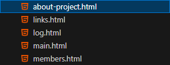

# Проектная (учебная) практика
# Базовая часть (Документация по созданию статического сайта)
## Введение
Документация описывает процесс разработки статического сайта, созданного в рамках базовой части проектной практики. Сайт содержит основную информацию о проекте, его участниках, ходе выполнения и ресурсах

- **Формат создания сайта**: Использования языков HTML и CSS
- **Репозиторий**: [Папка site](https://github.com/mariiiiiinad/Practice/tree/main/site)
- **Стек технологий**: HTML, CSS
___
## Структура сайта
#### Основные страницы:
| Страница | Назначение                                             |
|----------|--------------------------------------------------------|
|Главная   |Страница с аннотацией проекта                           |
|О проекте |Описание проекта и его цели, задачи, проблематика и т.д.|
|Команда   |Команда проекта, какова роль каждого участника          |
|Журнал    |Страница со статьями о проделанной работы               |
|Ресурсы   |Полезные ссылки, источники, партнёры                    |
___
# Процесс разработки
## 1. Установка инструментов для создания сайта
Прежде чем начать создание сайта, необходимо установить среду, где будет выполняться работа. Для этой задачи был выбран Visual Studio Code.
Также были установлены расширения, для облегчения и ускорения работы:
| Расширение           | Назначение                                                                |
|----------------------|---------------------------------------------------------------------------|
|Live Server           |Запускает сайт с автообновлением                                           |
|Auto Rename Tag       |Автоматически переименовывает парные HTML-теги                             |
|Auto Complete Tag     |Автоматически закрывает HTML/XML-теги при вводе                            |
|Auto Close Tag        |Автоматически добавляет закрывающий тег при вводе >                        |
|eCSStractor for VSCode|Позволяет выносить CSS из HTML-файлов в отдельный .css-файл                |
|indent-rainbow        |Подсвечивает отступы (indents) в коде разными цветами для лучшей читаемости|
## 2. Создание структуры сайта
После того как все было подготовлено, необоходимо было определить структуру сайта. Так как требовалось создать всего 5 страниц, было принято решение сделать все эти страницы главными с быстрым доступом из header.
Чтобы это реализовать, первым делом было создано 5 файлов с расширением html для каждой из страниц.

## 3. Стили
Реализация стилей происходит с помощью 
